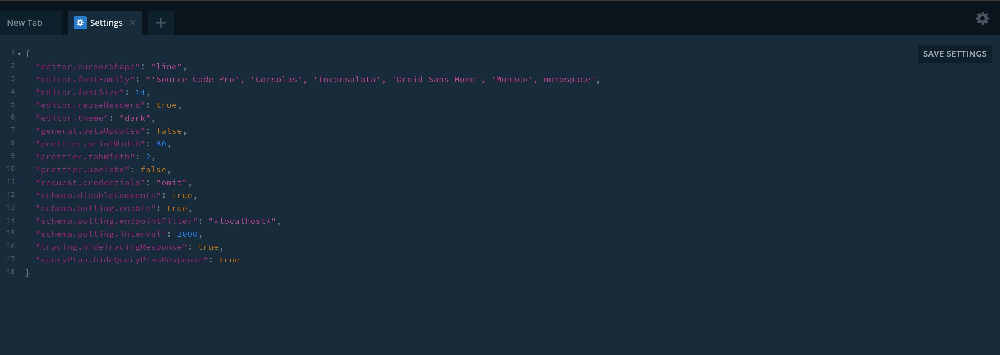

# Servidor

* **Iniciar el servidor** -> node server.js

# Qué hay?

* ` ./constants` -> Data de prueba
* `./img` -> Imagenes de estos docs
* `server.js` -> Entrypoint del servidor

## GraphQL Playground

Es una tool que se abre cuando apuntamos localhost a nuestro endopoint de graphql.

Aqui podremos setear ciertas settings, como cada cuantos ms vamos a hacer un llamado al servicio para ver si cambio algo.

Tambien para probar nuestros parametros.

En Docs podemos ver nuestras entidades y sus propiedades.

## Definicion de Variables

* String! => No puede ser null.
* [String]! => La lista no puede ser nula.
* [String!] => No pueden haber elementos nulos pero la lista puede ser nula.
* [String!]! => Ni la lista ni los elementos pueden ser nulos.

