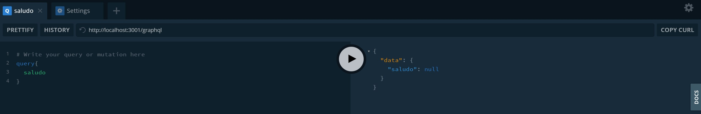

# Servidor 🎉️ 

* **Iniciar el servidor** -> node server.js

# Qué hay? 👀️ 

* ` ./constants` -> Data de prueba
* `./img` -> Imagenes de estos docs
* `server.js` -> Entrypoint del servidor

## GraphQL Playground 🎉️ 

Es una tool que se abre cuando apuntamos localhost a nuestro endopoint de graphql.

Aqui podremos setear ciertas settings, como cada cuantos ms vamos a hacer un llamado al servicio para ver si cambio algo.

Tambien para probar nuestros parametros.

En Docs podemos ver nuestras entidades y sus propiedades.

## Definicion de Variables 👀️ 

* String! => No puede ser null.
* [String]! => La lista no puede ser nula.
* [String!] => No pueden haber elementos nulos pero la lista puede ser nula.
* [String!]! => Ni la lista ni los elementos pueden ser nulos.

## Argumentos Resolver 👀️

* **root/parent** : Contiene el resultado devuelto por el resolver en el campo padre (UserID en tasks es 1).
* **args** : Un objeto con los argumentos pasados dentro del campo.
* **context**: Compartido por todos los resolvers, contiene el estado de la pre-request.
* **resolverInfo** : Contiene la informacion especifica de la query y sus campos, como el nombre del campo, path al mismo, etc.

